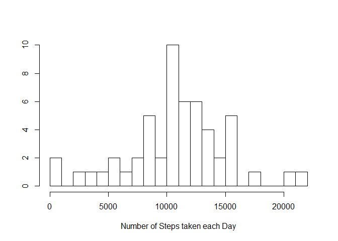

# Reproducible Research: Peer Assessment 1


## Loading and preprocessing the data


```r
activity = read.csv("activity.csv")

new_activity = na.omit(activity)

new_activity <- new_activity[which(new_activity$steps > 0),]

new_activity <- tbl_df(new_activity)

by_date <- group_by(new_activity, date)
```


## What is mean total number of steps taken per day?

* Calculate the total number of steps taken per day
* Make a histogram of the total number of steps taken each day
* Calculate and report the mean and median of the total number of steps taken per day


```r
        sum_Results <- summarize(by_date, sum(steps))
        colnames(sum_Results) <- c("Date", "Steps")
        knitr::kable(head(sum_Results))
```


Date          Steps
-----------  ------
2012-10-02      126
2012-10-03    11352
2012-10-04    12116
2012-10-05    13294
2012-10-06    15420
2012-10-07    11015


```r
        hist(sum_Results$Steps, main ="", xlab="Number of Steps taken each Day", ylab = "", breaks = 50)
```

 


```r
        mean_Results <- as.integer(mean(sum_Results$Steps))
        median_Results <- median(sum_Results$Steps)
```

The mean is 10766 and the median is 10765.

## What is the average daily activity pattern?
* Make a time series plot (i.e. type = "l") of the 5-minute interval (x-axis) and the average number of steps taken, averaged across all days (y-axis)
* Which 5-minute interval, on average across all the days in the dataset, contains the maximum number of steps?


```r
        by_Interval <- aggregate(steps ~ interval, data = activity, FUN = mean  
                                    )
```

## Imputing missing values


## Are there differences in activity patterns between weekdays and weekends?
