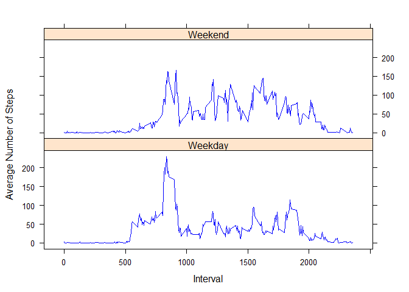

# Reproducible Research: Peer Assessment 1

## Loading and preprocessing the data

```r
        data<-read.csv("activity.csv" , header=TRUE)
```


## What is mean total number of steps taken per day?

```r
data$date<-as.Date(data$date,format = '%Y-%m-%d')
total_Steps <-aggregate(steps~date, data=data,sum, na.rm=TRUE)
head(total_Steps)
```

```
##         date steps
## 1 2012-10-02   126
## 2 2012-10-03 11352
## 3 2012-10-04 12116
## 4 2012-10-05 13294
## 5 2012-10-06 15420
## 6 2012-10-07 11015
```

```r
barplot(total_Steps$steps, names.arg =total_Steps$date, main="Number of Steps per Day",xlab="Date", ylab="Steps")
```

 

```r
mean_Steps <- as.integer(mean(total_Steps$steps))
median_Steps <- median(total_Steps$steps)
```

* The mean steps is 10766 and the median steps is 10765.

## What is the average daily data pattern?


```r
steps_Interval <-aggregate(steps~ interval , data=data,mean, na.rm=TRUE)
plot(steps_Interval$interval, steps_Interval$steps, type="l",xlab="interval",ylab="average steps")
```

 

```r
max_Interval <- steps_Interval[which.max(  
        steps_Interval$steps),]
```

*  The maximum number of steps is 206 found at interval 835.


## Imputing missing values

```r
missing_Values <- sum(!complete.cases(activity))
```
* The number of missing values in the data is 2304.


```r
data <- merge(data,steps_Interval, by = "interval", suffixes = c("",".y"))
missing <- is.na(data$steps)
data$steps[missing] <- data$steps.y[missing]
data_new <- data[, c(1:3)]
steps_per_day<-aggregate(steps ~ date, data_new, sum)
barplot(steps_per_day$steps, names.arg=steps_per_day$date, xlab="date", ylab="steps", main="Number of steps per day", col="red")
```

 

```r
missing_Mean <- as.integer(mean(steps_per_day$steps))
missing_Median <- as.integer(median(steps_per_day$steps))
```
*  The missing value mean is 10766 and mising value median is 10766. 


## Are there differences in data patterns between weekdays and weekends?


```r
library(lattice)
```

```
## Warning: package 'lattice' was built under R version 3.1.3
```

```r
data_new$date<-as.Date(data_new$date,format = '%Y-%m-%d')
data_new$day <- ifelse(weekdays(data_new$date) %in% c("Saturday", "Sunday"),'Weekend','Weekday')
steps_by_interval_and_Daytype<-aggregate(steps~ interval+day,data_new,FUN="mean")
xyplot(steps ~ interval | day, steps_by_interval_and_Daytype, layout = c(1, 2), type = "l", col="blue", xlab="Interval", ylab="Average Number of Steps")
```

 

*  By observing the graphs we learn that this individual is more active on the weekend than on the weekdays. 
